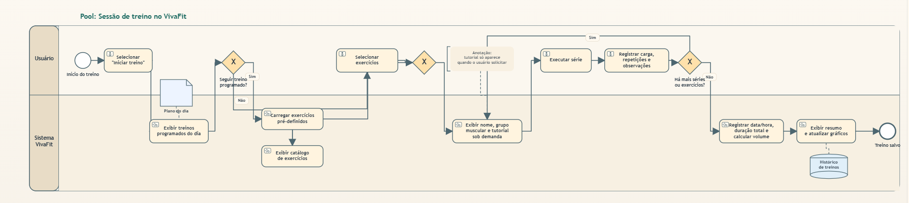
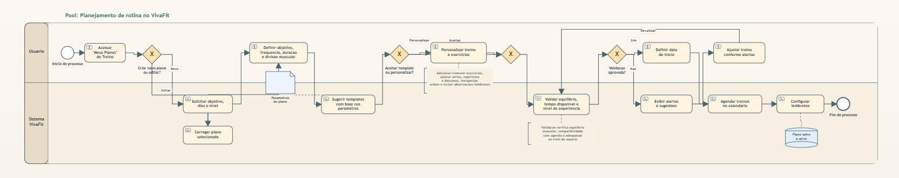
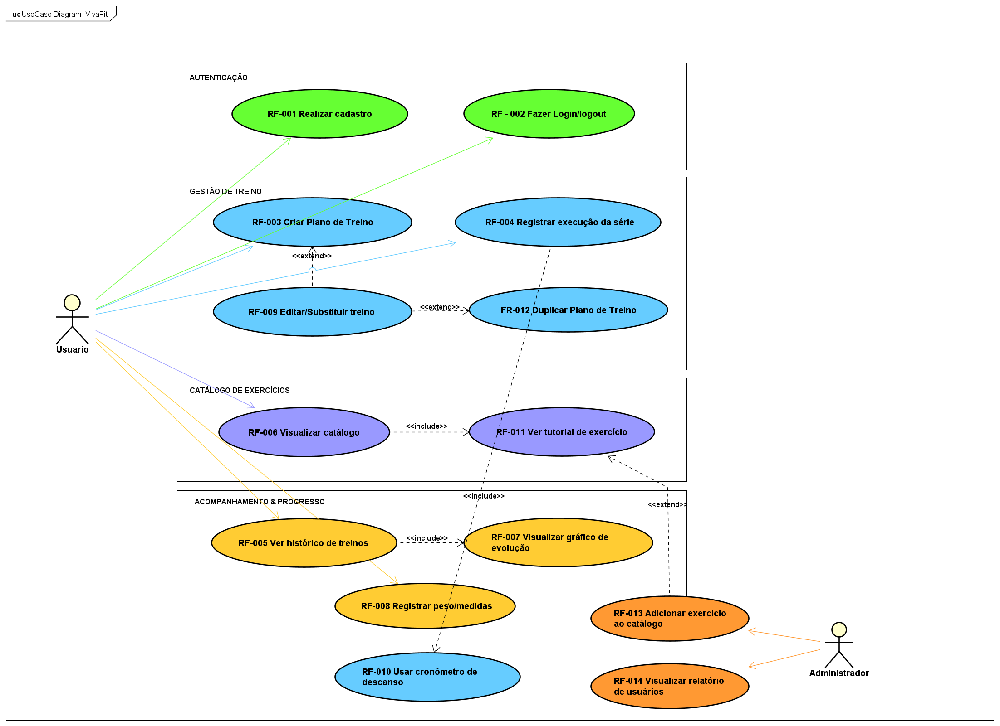
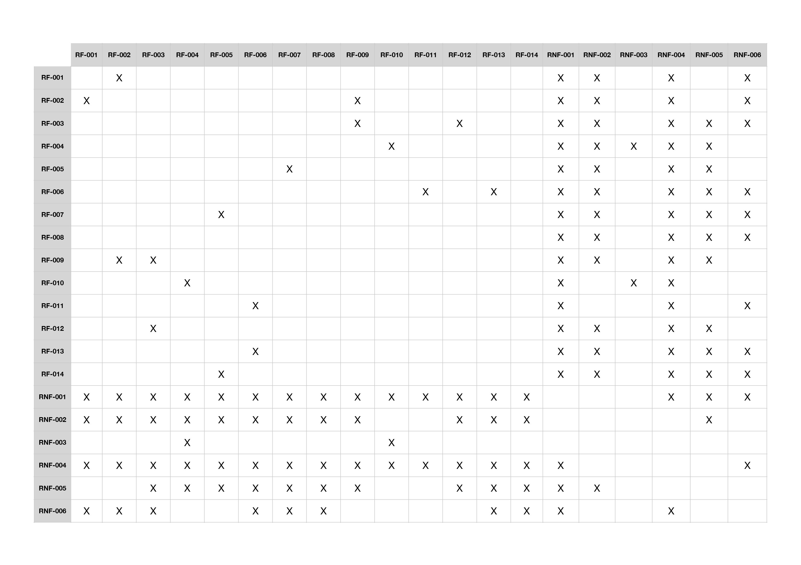

P# Especificações do Projeto

Esta seção apresenta a proposta de solução do projeto VivaFit a partir da perspectiva dos usuários, considerando as necessidades relacionadas à organização de treinos, ao registro estruturado de cargas e repetições e ao acompanhamento da evolução física ao longo do tempo. Para isso, são utilizadas técnicas de análise e especificação de requisitos que permitem compreender os diferentes perfis de usuários e traduzir essas necessidades em funcionalidades para o sistema, com foco em tornar o processo de treino mais organizado, acessível e motivador.

Nesta parte do documento são apresentados as personas, as histórias de usuários, os requisitos funcionais e não funcionais e as restrições do projeto, elementos fundamentais para estruturar as funcionalidades e limitações da solução proposta, especialmente no que diz respeito à criação de uma experiência simples, intuitiva e voltada à adesão contínua aos treinos. Complementando essa etapa de especificação, a seção também inclui a modelagem dos processos de negócio, os indicadores de desempenho, o diagrama de casos de uso e a matriz de rastreabilidade. Essas ferramentas auxiliam na organização, compreensão e validação das funcionalidades do sistema, permitindo estruturar de forma clara como o aplicativo atenderá às necessidades dos usuários, como o planejamento eficiente de treinos, o registro prático das atividades e a visualização da evolução, e garantindo o alinhamento entre os requisitos definidos e a solução proposta.

## Personas

## Histórias de Usuários

Com base na análise das personas forma identificadas as seguintes histórias de usuários:

|EU COMO... `PERSONA`| QUERO/PRECISO ... `FUNCIONALIDADE` |PARA ... `MOTIVO/VALOR`                 |
|--------------------|------------------------------------|----------------------------------------|
|Ricardo Oliveira - Analista de Sistemas       | Registrar cargas e repetições em menos de 5 segundos durante o descanso.  | Não perder o ritmo do treino e manter o foco.      |
|Dayane Menezes - Advogada      | Acessar cronogramas de treinos curtos e eficientes (30-40 min).      | Conciliar a atividade física com prazos judiciais apertados. |
|Cleverson da Silva - Caminhoneiro      | Visualizar sugestões de exercícios rápidos que podem ser feitos em qualquer lugar.     | Manter a saúde em dia mesmo durante longas viagens na estrada.  |
|Beatriz Dias - Estagiária     | Receber orientações claras e tutoriais simples sobre como executar cada exercício.    | Evitar lesões por inexperiência e ganhar confiança na academia.  |
|Juliana Martins - Médica     | Adaptar meu plano de treino conforme a disponibilidade da minha agenda de plantões.    | Manter a constância sem o estresse de seguir horários fixos.    |
|Sebastião de Assis - Eletricista    | Monitorar meu progresso físico e de saúde de forma visual e simplificada.    | Sentir-me motivado ao ver que minha condição física está melhorando.   |
|Ricardo Oliveira - Analista de Sistemas  | Visualizar gráficos de linha detalhados sobre minha evolução de força por grupamento muscular. | Analisar meu desempenho técnico e superar platôs de resultados. |
|Dayane Menezes - Advogada      | Registrar meu peso e medidas antropométricas periodicamente.    | Acompanhar a perda de peso e a redução de medidas de forma organizada.  |   
|Darly Paim - Adm. do Aplicativo | Gerenciar o banco de dados de exercícios, adicionando novas modalidades e vídeos explicativos, em parceria com os profissionais da área de Ed. Física.  | Manter o catálogo do aplicativo atualizado e útil para todos os níveis de usuários. |
|Darly Paim - Adm. do Aplicativo | Extrair relatórios de engajamento e frequência dos usuários por faixa etária e localização. | Identificar perfis que precisam de mais incentivo e melhorar as funcionalidades do app.|

## Modelagem do Processo de Negócio 

### Análise da Situação Atual

Atualmente, a maioria dos praticantes de academia gerencia seus treinos de forma manual e descentralizada, utilizando cadernos físicos, planilhas eletrônicas, aplicativos genéricos de notas ou até mesmo a memória. Esse modelo apresenta diversos problemas que dificultam a evolução e a consistência dos treinos:

**Registro de Treinos:** Os usuários anotam cargas e repetições em cadernos ou no próprio celular usando aplicativos de notas básicos. Esse processo é lento, desorganizado e não oferece visualização clara do progresso ao longo do tempo. Profissionais como Ricardo (Analista de Sistemas) perdem tempo precioso durante o descanso entre séries tentando registrar os dados de forma eficiente.

**Planejamento de Rotinas:** A elaboração de cronogramas de treino geralmente depende de planilhas complexas fornecidas por personal trainers ou impressas em papel. Usuários com agendas imprevisíveis, como Dayane (Advogada) e Juliana (Médica), enfrentam dificuldade em adaptar esses planos fixos às suas rotinas variáveis, resultando em abandono ou inconsistência nos treinos.

**Acompanhamento de Progresso:** A visualização da evolução física (peso, medidas, força) é praticamente inexistente ou depende de gráficos feitos manualmente em planilhas. Usuários como Sebastião (Eletricista) têm dificuldade em perceber sua própria evolução, o que impacta negativamente a motivação para continuar.

**Orientação sobre Exercícios:** Iniciantes como Beatriz (Estagiária) dependem exclusivamente de instrutores presenciais para aprender a execução correta dos exercícios. Não há acesso fácil a tutoriais ou demonstrações visuais durante o treino, aumentando o risco de lesões por técnica inadequada.

**Adaptação para Diferentes Contextos:** Profissionais com rotinas atípicas, como Cleverson (Caminhoneiro), não possuem ferramentas que sugiram exercícios alternativos para ambientes fora da academia, limitando a prática de atividades físicas durante viagens ou deslocamentos.

Essa fragmentação de ferramentas e a falta de integração entre planejamento, execução e acompanhamento de treinos criam barreiras significativas para que os usuários mantenham regularidade, visualizem resultados concretos e se sintam motivados a persistir em seus objetivos de saúde e bem-estar. 

### Descrição Geral da Proposta

O **VivaFit** propõe uma solução integrada e acessível para o gerenciamento completo de treinos de academia, consolidando em uma única aplicação móvel as funcionalidades de planejamento, registro, acompanhamento e orientação de atividades físicas. A proposta visa eliminar as barreiras identificadas na situação atual, oferecendo uma experiência fluida e motivadora para praticantes de todos os níveis de experiência.

**Escopo e Funcionalidades Principais:**

A aplicação permitirá que os usuários:
- Registrem rapidamente cargas, repetições e séries durante o treino (em menos de 5 segundos)
- Planejem rotinas de exercícios personalizadas e adaptáveis a diferentes contextos (academia, casa, viagem)
- Acompanhem sua evolução através de gráficos visuais detalhados de peso, medidas e força por grupamento muscular
- Acessem tutoriais e orientações sobre a execução correta de exercícios
- Adaptem seus planos de treino conforme disponibilidade e mudanças na rotina

**Alinhamento com Objetivos de Negócio e ODS 3:**

O VivaFit está diretamente alinhado com a ODS 3 (Saúde e Bem-Estar) da ONU, promovendo a prática regular de atividades físicas através da democratização do acesso a ferramentas de planejamento e monitoramento. A solução atende a uma demanda crescente por autonomia no gerenciamento da saúde pessoal, especialmente relevante em um contexto pós-pandêmico onde a busca por hábitos saudáveis se intensificou.

**Oportunidades de Melhoria:**

1. **Redução de Fricção no Registro:** Eliminar o tempo perdido com anotações manuais, permitindo registro ultrarrápido de dados durante o treino
2. **Visualização de Progresso:** Substituir planilhas complexas por dashboards intuitivos com gráficos automáticos de evolução
3. **Acessibilidade de Conhecimento:** Democratizar o acesso a orientações técnicas sobre exercícios, reduzindo a dependência de instrutores presenciais
4. **Flexibilidade de Rotina:** Permitir adaptação dinâmica de treinos para diferentes perfis (profissionais com horários irregulares, viajantes, iniciantes)
5. **Motivação Contínua:** Criar um ciclo de feedback visual que mantenha os usuários engajados ao verem resultados concretos

**Limites da Solução:**

- A aplicação não substitui a orientação de profissionais de educação física para prescrição inicial de treinos ou necessidades específicas de reabilitação
- Não contempla funcionalidades de nutrição ou acompanhamento médico especializado
- Depende de autogestão e disciplina do usuário para inserção consistente de dados
- Versão inicial focará em treinos de musculação e exercícios funcionais, não incluindo modalidades específicas como natação, lutas ou esportes coletivos

A proposta representa uma evolução significativa em relação aos métodos tradicionais, integrando tecnologia móvel acessível com as necessidades práticas dos praticantes de academia contemporâneos.

### Processo 1 – REGISTRO E EXECUÇÃO DE TREINO

Este processo representa o fluxo completo de uma sessão de treino, desde o início até o registro final dos dados de desempenho. É o processo central da aplicação, executado diariamente pelos usuários.

**Fluxo do Processo:**

1. **Início:** Usuário acessa o aplicativo e seleciona "Iniciar Treino"
2. **Selecionar Plano de Treino:** Sistema apresenta os treinos programados para o dia (Treino A, B, C, etc.)
3. **Decisão:** Usuário escolhe seguir o treino programado ou criar treino livre
   - Se programado: Sistema carrega exercícios pré-definidos
   - Se livre: Usuário seleciona exercícios manualmente do catálogo
4. **Executar Série:** Para cada exercício:
   - Sistema exibe nome, grupo muscular e tutorial (se solicitado)
   - Usuário executa a série
   - Usuário registra: carga utilizada, número de repetições, observações
5. **Decisão:** Há mais séries/exercícios?
   - Se sim: Retorna ao passo 4
   - Se não: Avança para finalização
6. **Finalizar Treino:** Sistema registra data/hora, duração total e calcula volume de treino
7. **Feedback Visual:** Sistema exibe resumo da sessão e atualiza gráficos de progresso
8. **Fim:** Dados salvos no histórico do usuário

**Oportunidades de Melhoria:**

- **Velocidade de Registro:** Reduzir de ~30 segundos (método manual) para menos de 5 segundos por série
- **Precisão de Dados:** Eliminar erros de transcrição comuns em anotações manuais
- **Contexto em Tempo Real:** Mostrar carga/repetições da última sessão para comparação imediata
- **Adaptação Dinâmica:** Permitir substituição de exercícios durante o treino (equipamento ocupado, lesão, etc.)
- **Gamificação:** Notificações de conquistas ao superar recordes pessoais

### Processo 2 – PLANEJAMENTO E ADAPTAÇÃO DE ROTINA DE TREINO

Este processo descreve como os usuários criam, personalizam e adaptam suas rotinas de treino semanais/mensais, garantindo flexibilidade para diferentes perfis e agendas.

**Fluxo do Processo:**

1. **Início:** Usuário acessa "Meus Planos de Treino"
2. **Decisão:** Criar novo plano ou editar existente?
   - Se novo: Sistema solicita informações (objetivo, dias disponíveis, nível de experiência)
   - Se editar: Sistema carrega plano selecionado
3. **Definir Parâmetros:**
   - Objetivo (hipertrofia, emagrecimento, condicionamento, força)
   - Frequência semanal (3x, 4x, 5x, 6x)
   - Duração estimada por sessão (30-40 min, 60 min, 90+ min)
   - Divisão muscular (ABC, ABCD, Push-Pull-Legs, Full Body, etc.)
4. **Sistema Apresenta Modelos de Referência:** : Baseado nos parâmetros informados, o sistema exibe modelos de treino previamente cadastrados por profissionais de Educação Física parceiros, que podem ser utilizados como ponto de partida mediante orientação profissional
5. **Decisão:** Aceitar template ou personalizar?
   - Se aceitar: Avança para passo 7
   - Se personalizar: Prossegue para passo 6
6. **Personalizar Treino:**
   - Adicionar/remover exercícios do catálogo
   - Ajustar séries, repetições, descanso
   - Reorganizar ordem dos exercícios (arrastar e soltar)
   - Adicionar observações/lembretes
7. **Verificação:** Sistema confere:
   - Equilíbrio entre grupos musculares, de responsabilidade do profissional de 
     Educação Física
   - Tempo estimado vs. disponibilidade declarada
   - Compatibilidade com nível de experiência, de responsabilidade do profissional de 
     Educação Física
8. **Decisão:** Validação aprovada?
   - Se não: Sistema exibe alertas/sugestões e retorna ao passo 6
   - Se sim: Avança para passo 9
9. **Ativar Plano:** Usuário define data de início e sistema agenda treinos no calendário
10. **Notificações:** Sistema configura lembretes para dias de treino
11. **Fim:** Plano salvo e ativo

**Oportunidades de Melhoria:**

- **Automação Inteligente:** Templates predefinidos eliminam necessidade de criar do zero (economia de 60-90 minutos)
- **Flexibilidade:** Troca de dias/exercícios em tempo real sem recriar todo o plano
- **Adaptação Contextual:** Sugestões automáticas para treinos em casa, hotel ou com equipamentos limitados (atende Cleverson - Caminhoneiro)
- **Progressão Assistida:** Sistema exibe o histórico de desempenho do usuário para que haja a orientação de um profissional na progressão de cargas ao longo do tempo
- **Acessibilidade:** Interface visual simplificada para iniciantes (atende Beatriz - Estagiária)

## Indicadores de Desempenho

Para acompanhar a eficácia do VivaFit, foram definidos indicadores orientados à experiência e aos resultados concretos dos usuários ao longo dos processos de registro de treino, planejamento e acompanhamento da evolução física. As métricas abaixo medem o que o usuário conquista ao utilizar o aplicativo, se está progredindo, mantendo regularidade e atingindo seus objetivos de saúde e bem-estar.

| Indicador | Objetivos | Descrição | Cálculo | Fonte dados | Perspectiva |
|-----------|-----------|-----------|---------|-------------|-------------|
Evolução de carga por exercício | Medir progresso de força do usuário | % de aumento de carga média por exercício em 4 semanas | ((Carga média semana 4 − semana 1) / semana 1) × 100 | Tabela Registro de Série, Exercício | Crescimento do usuário
Frequência semanal de treino | Medir regularidade do usuário | Média de sessões concluídas por usuário na semana | Total de sessões / Nº de usuários ativos na semana | Tabela Sessão, Usuário | Comportamento do usuário
Aderência ao plano de treino | Avaliar se o usuário segue o que planejou | % de exercícios planejados efetivamente executados | (Exercícios executados / Exercícios planejados) × 100 | Tabela Plano, Sessão, Exercício | Comportamento do usuário
Taxa de registro de progresso físico | Medir se o usuário acompanha sua evolução corporal | % de usuários que registraram peso/medidas ao menos 1x por mês | (Usuários com registro / Total ativos no mês) × 100 | Tabela Registro Corporal, Usuário | Engajamento do usuário
Tempo médio até primeiro treino | Avaliar se o app facilita o início da jornada do usuário | Dias entre o cadastro e a primeira sessão concluída | Soma dos dias (cadastro → 1ª sessão) / Total usuários | Tabela Usuário, Sessão | Experiência do usuário
Progressão de volume semanal | Medir se o usuário está evoluindo na quantidade total de treino | Variação do volume total (séries × reps × carga) semana a semana por usuário | (Volume semana atual − semana anterior) / Volume semana anterior × 100 | Tabela Registro de Série | Crescimento do usuário
Taxa de conclusão de treinos | Verificar se o usuário termina o que começa | % de sessões iniciadas que foram finalizadas | (Sessões finalizadas / Sessões iniciadas) × 100 | Tabela Sessão de Treino | Experiência do usuário

Obs.: todas as informações para gerar os indicadores devem estar no diagrama de classe a ser apresentado a posteriori.

## Requisitos

As tabelas que se seguem apresentam os requisitos funcionais e não funcionais que detalham o escopo do projeto. Para determinar a prioridade de requisitos, foi aplicada a técnica **MoSCoW** (Must have, Should have, Could have, Won't have), considerando:
- **Must have:** Funcionalidades essenciais para o MVP, sem as quais o aplicativo não cumpre seu propósito básico
- **Should have:** Funcionalidades importantes que agregam valor significativo à experiência do usuário
- **Could have:** Funcionalidades desejáveis que podem ser implementadas em versões futuras
- **Won't have:** Funcionalidades explicitamente fora do escopo desta versão.

A priorização considerou o prazo de desenvolvimento (3 meses), a equipe disponível (6 integrantes) e a viabilidade técnica para um projeto acadêmico.

### Requisitos Funcionais

|ID    | Descrição do Requisito  | Prioridade | Persona Atendida |
|------|-------------------------|------------|------------------|
|RF-001| O sistema deve permitir que o usuário realize cadastro com e-mail e senha | Must have | Todas |
|RF-002| O sistema deve permitir que o usuário administrador/educador físico faça login e logout da aplicação | Must have | Todas |
|RF-003| O sistema deve permitir que o usuário visualize e siga o plano de treino indicado pelo seu profissional de Educação Física, que define exercícios, séries e repetições | Must have | Dayane, Juliana |
|RF-004| O sistema deve permitir registrar a execução de exercícios com carga e repetições realizadas em até 5 segundos | Must have | Ricardo |
|RF-005| O sistema deve exibir o histórico completo de treinos realizados com data, exercícios e cargas utilizadas | Must have | Sebastião, Ricardo |
|RF-006| O sistema deve apresentar catálogo de exercícios com nome, grupo muscular e descrição básica | Should have | Beatriz |
|RF-007| O sistema deve permitir visualizar gráfico de evolução de carga por exercício ao longo do tempo | Should have | Ricardo, Sebastião |
|RF-008| O sistema deve permitir registrar peso corporal e visualizar histórico em formato de lista | Should have | Dayane |
|RF-009| O sistema deve permitir editar ou substituir exercícios | Should have | Juliana, Cleverson |
|RF-010| O sistema deve incluir cronômetro de descanso entre séries com notificação sonora | Could have | Ricardo |
|RF-011| O sistema deve permitir visualizar tutorial de cada exercício com instruções em texto | Could have | Beatriz |
|RF-012| O sistema deve permitir duplicar um plano de treino existente para criar variações | Could have | Juliana |
|RF-013| O sistema deve permitir ao administrador/educador físico adicionar novos exercícios ao catálogo com nome, grupo muscular e descrição | Could have | Administrador |
|RF-014| O sistema deve permitir ao administrador/educador físico visualizar relatório básico com número total de usuários cadastrados e treinos registrados | Could have | Administrador |

### Requisitos não Funcionais

|ID     | Descrição do Requisito  |Prioridade | Justificativa |
|-------|-------------------------|-----------|---------------|
|RNF-001| O sistema deve ser responsivo e funcionar em dispositivos móveis Android e iOS | Must have | Aplicação mobile-first para uso na academia |
|RNF-002| O sistema deve armazenar dados localmente no dispositivo do usuário | Must have | Funcionar offline e garantir acesso durante treinos |
|RNF-003| A interface de registro de exercícios deve permitir entrada de dados em no máximo 5 segundos | Must have | Atender requisito crítico de velocidade (Ricardo) |
|RNF-004| O sistema deve utilizar paleta de cores com bom contraste para facilitar leitura em ambientes claros (academia) | Should have | Usabilidade em diferentes condições de iluminação |
|RNF-005| O sistema deve manter o desempenho estável com até 500 exercícios cadastrados no histórico | Should have | Garantir performance com uso prolongado |
|RNF-006| O sistema deve seguir diretrizes de acessibilidade básica (WCAG 2.1 nível A) | Could have | Inclusão de usuários com diferentes necessidades | 

## Restrições

O projeto está restrito pelos itens apresentados na tabela a seguir.

| ID | Restrição |
|----|------------|
| R-01 | O projeto deverá ser entregue até o final do semestre letivo. |
| R-02 | Não será desenvolvido módulo de backend, devendo o sistema funcionar apenas com armazenamento local no dispositivo. |
| R-03 | O projeto contará com equipe composta por 6 integrantes. |
| R-05 | A aplicação será desenvolvida exclusivamente para ambiente mobile, não contemplando versão web nesta etapa. |
| R-06 | O aplicativo não realizará prescrição de treinos, função exclusiva de profissionais habilitados de Educação Física. O sistema atuará como ferramenta de suporte ao registro e acompanhamento do plano indicado pelo profissional. |

## Diagrama de Casos de Uso

O diagrama de casos de uso será elaborado para ilustrar as interações entre as personas e o sistema da VivaFit. Cada persona terá casos de uso específicos que refletem suas necessidades e interações com o sistema. 

* Atores identificados:

Usuário — persona principal (Ricardo, Dayane, Beatriz, Juliana, Cleverson, Sebastião)

Administrador — ator secundário com acesso ao catálogo e relatórios

# Matriz de Rastreabilidade

# Gerenciamento de Projeto

O gerenciamento do projeto do aplicativo VivaFit será realizado de forma organizada, com definição das etapas, responsabilidades e objetivos de cada fase. O projeto inicia com o levantamento de requisitos e definição do problema, seguido pelo desenvolvimento das funcionalidades do aplicativo.

Durante o desenvolvimento, são realizados o planejamento e a execução de testes de funcionalidades e usabilidade, permitindo validar o funcionamento do sistema e identificar possíveis melhorias. Por fim, são feitas as considerações finais e a preparação da entrega do projeto.

O aplicativo tem como objetivo auxiliar na organização de rotinas de exercícios e no acompanhamento da evolução física dos usuários, incentivando hábitos saudáveis e contribuindo para a promoção da saúde e do bem-estar, em alinhamento com o Objetivo de Desenvolvimento Sustentável 3 (ODS 3).

## Gerenciamento de Tempo

O gerenciamento de tempo do projeto foi definido a partir de um cronograma que organiza as principais etapas de desenvolvimento do aplicativo VivaFit. O projeto inicia com o levantamento de requisitos e definição do problema, etapa responsável por identificar as necessidades dos usuários e estabelecer o escopo do sistema.

Em seguida ocorre a programação das funcionalidades do aplicativo, fase mais extensa do projeto. Durante esse período também são realizados o planejamento e a execução dos testes de funcionalidades e usabilidade, que acontecem em paralelo ao desenvolvimento para garantir a qualidade do sistema.

Por fim, são realizadas as considerações finais e a preparação da entrega do projeto. Esse planejamento permite acompanhar a evolução das atividades ao longo do tempo, facilitando o controle do progresso e a identificação de possíveis atrasos.

## Gerenciamento de Equipe

Para a organização e execução do projeto VivaFit, foi adotada a metodologia ágil Scrum, que estrutura o desenvolvimento por meio de ciclos iterativos (sprints) e define papéis específicos dentro da equipe.

A equipe é composta por seis integrantes, distribuídos da seguinte forma:

•	Scrum Master: Maria Luisa, responsável por acompanhar o andamento do projeto, organizar as reuniões e ajudar a resolver impedimentos que surgirem durante o desenvolvimento.

•	Product Owner: Jefferson, responsável por definir e priorizar as funcionalidades do aplicativo, sempre pensando na experiência do usuário. 

•	Equipe de Desenvolvimento: Erick, Dairly e José, responsáveis por construir as telas, componentes e funcionalidades do aplicativo. 

•	Equipe de Design: Alyne, responsável pela parte visual do aplicativo, incluindo layout, organização das informações e usabilidade.

## Gestão de Orçamento

A gestão de orçamento do projeto considera os recursos necessários para o desenvolvimento do aplicativo VivaFit ao longo de 6 meses. Foram estimados custos relacionados aos recursos humanos envolvidos nas etapas de análise, desenvolvimento, testes e documentação, considerando uma equipe composta por 6 integrantes, com remuneração média mensal de R$ 4.000, totalizando R$ 144.000.

Além disso, foram incluídos custos com hardware, infraestrutura de rede, ferramentas de software e serviços externos utilizados durante o projeto. Os valores apresentados representam uma estimativa fictícia de custos caso o projeto fosse desenvolvido em um ambiente profissional, sendo proporcionais ao escopo do projeto, que contempla apenas o desenvolvimento front-end da aplicação.

