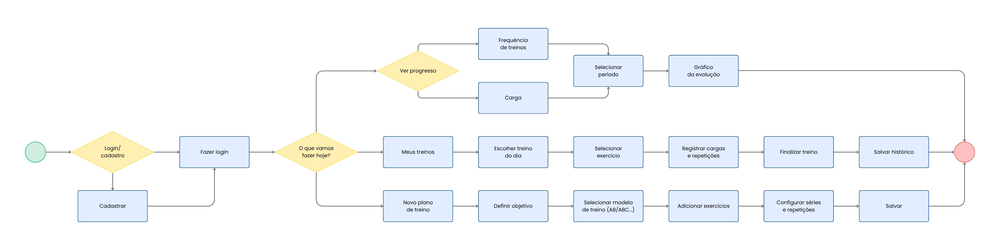

# Projeto de Interface

### Descrição Geral do Projeto de Interface:

O projeto de interface do **Viva Fit** foi concebido com foco na usabilidade e na eficiência, buscando reduzir o esforço cognitivo do usuário durante a prática de atividades físicas. A interface é dividida em fluxos lógicos que permitem desde a gestão administrativa de treinos até o acompanhamento visual do progresso físico.

### 1. Fluxo de Navegação e Experiência do Usuário (UX)
Conforme o diagrama de fluxo, a aplicação utiliza uma estrutura de decisão central ("O que vamos fazer hoje?") que ramifica a experiência em três pilares principais:

* **Gestão de Treinos:** Permite a criação de novos planos personalizados, definindo objetivos e modelos de treino (AB/ABC).
* **Execução e Registro:** Foco na rotina diária, onde o usuário seleciona o exercício do dia e registra cargas e repetições em tempo real.
* **Análise de Dados:** Um ambiente dedicado à visualização da frequência de treinos e evolução de cargas através de gráficos.

### 2. Design Visual e Componentes (UI)
Os wireframes revelam uma interface adaptativa (Mobile e Web), caracterizada pelos seguintes elementos:

* **Arquitetura de Telas:** Utilização de telas de *Splash* e *Login/Cadastro* limpas, com foco em campos de entrada intuitivos e autenticação simplificada.
* **Dashboard Central:** Uma tela de boas-vindas com botões de ação rápida (*Novo Plano*, *Meus Treinos*, *Ver Progresso*), facilitando o acesso às funções mais importantes.
* **Interfaces de Listagem e Registro:** Uso de listas expansíveis e campos numéricos otimizados para o registro de exercícios, garantindo que o usuário consiga inserir dados mesmo em ambiente de academia.
* **Visualização de Dados:** Implementação de componentes de gráficos e cards de resumo na tela de progresso, transformando dados brutos em informações visuais de fácil compreensão.

### 3. Adaptabilidade
O projeto prevê uma interface **Responsiva**, conforme demonstrado nos wireframes que apresentam as variações para Desktop (Web) e dispositivos móveis (Mobile). A disposição dos elementos é reorganizada em colunas únicas no mobile para garantir o conforto do toque e a legibilidade em telas menores.

## Diagrama de Fluxo

O diagrama de fluxo a seguir representa o percurso de interação do usuário dentro do VivaFit, evidenciando como o aplicativo organiza, de forma lógica e intuitiva, as etapas de criação de novos treinos, execução e registro das atividades, além do acompanhamento do progresso físico. Essa estrutura contribui para um planejamento mais eficiente das interações, servindo como base para o desenvolvimento de um wireframe alinhado à proposta da aplicação móvel: oferecer praticidade, organização e uma visão clara da evolução do usuário.

## Wireframes

Os wireframes do VivaFit representam a estrutura inicial das telas da aplicação, organizando de forma clara a disposição dos elementos e funcionalidades principais. Nessa etapa, o foco está na usabilidade e na experiência do usuário, priorizando a simplicidade e a navegação intuitiva, sem a preocupação com aspectos visuais finais, como cores e identidade visual.

Eles foram desenvolvidos tanto no formato desktop quanto mobile, permitindo visualizar e adaptar a experiência para diferentes dispositivos e contextos de uso. Esses protótipos servem como base para validar o fluxo de interação e garantir que a aplicação atenda às necessidades do público-alvo de maneira prática, eficiente e alinhada aos objetivos do projeto.

