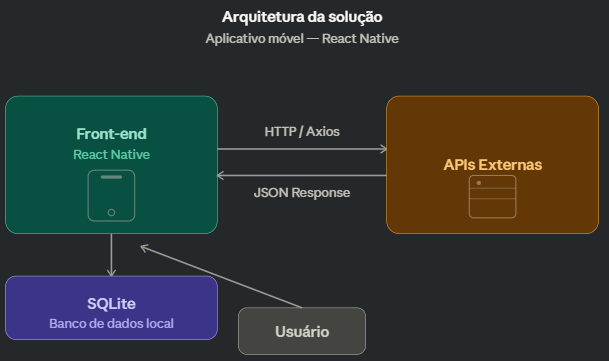
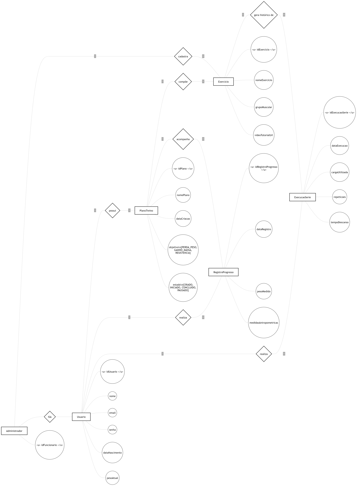
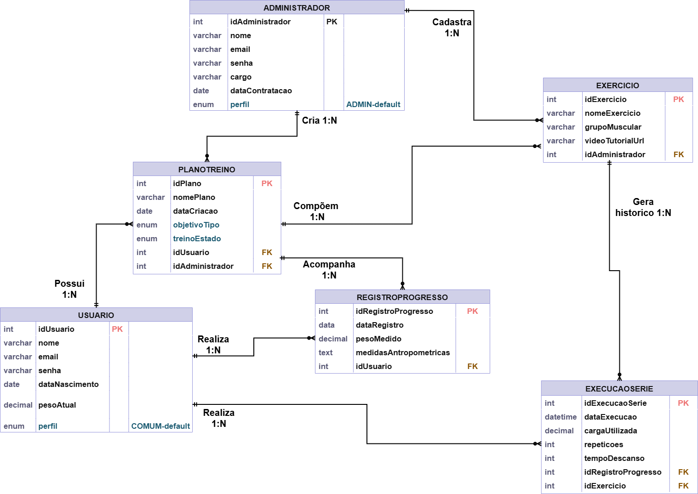

# Arquitetura da Solução

O aplicativo será desenvolvido para dispositivos móveis com foco principal na criação de um front-end moderno, proporcionando uma interface interativa e altamente responsiva. A camada de front-end será construída utilizando React Native, garantindo uma experiência de usuário fluida e dinâmica. A aplicação utiliza Firebase (Auth e Cloud Firestore) para persistência e autenticação, permitindo armazenamento em nuvem e sincronização entre sessões. Serão realizadas integrações com APIs por meio de requisições HTTP utilizando a biblioteca Axios, assegurando flexibilidade e escalabilidade.

## Diagrama de Classes

Em resumo, o sistema é composto por classes que gerenciam a autenticação e o perfil dos usuários (comum e administrador), a criação e duplicação de planos de treinos personalizados, o catálogo de exercícios com suporte a tutoriais, o registro detalhado das execuções de séries (cargas e repetições) e o acompanhamento da evolução física através de registros periódicos de peso e medidas.

## Modelo ER

O Modelo ER do VivaFit foi elaborado em notação conceitual (Chen), representando as entidades, os relacionamentos e os atributos centrais do domínio da aplicação. O diagrama apresenta a estrutura de dados necessária para o gerenciamento de usuários, planos de treino, catálogo de exercícios, execuções de séries e acompanhamento da evolução física.

As principais entidades do modelo são Usuario, Administrador, PlanoTreino, Exercicio, ExecucaoSerie e RegistroProgresso. Os relacionamentos mostram como o usuário possui planos e realiza registros e execuções, como o administrador cadastra exercícios e como os exercícios compõem os planos de treino e geram histórico de execução.

## Esquema Relacional

O projeto da base de dados corresponde à representação das entidades e relacionamentos identificados no Modelo ER, no formato de tabelas, com colunas e chaves primárias/estrangeiras necessárias para representar corretamente as restrições de integridade.

## Modelo de Dados em Nuvem

O modelo de persistência do projeto está centralizado no Firebase, com autenticação no Firebase Auth e dados no Cloud Firestore.

As regras de segurança e controle de acesso estão definidas em:

- [firebase/firestore.rules](../firebase/firestore.rules)

## Tecnologias Utilizadas

- **Git**: Ferramenta utilizada para o versionamento do código.
- **GitHub**: Repositório para armazenar os arquivos do projeto.

- **IDEs**: Softwares utilizados para o desenvolvimento do código
  - Visual Studio Code
  - Expo

- **Firebase Cloud Firestore**: Banco de dados NoSQL para armazenamento das informações da aplicação.
- **React Native**: Framework para desenvolvimento da interface do aplicativo.

## Hospedagem

Explique como a hospedagem e o lançamento da plataforma foi feita.

> **Links Úteis**:
>
> - [Website com GitHub Pages](https://pages.github.com/)
> - [Programação colaborativa com Repl.it](https://repl.it/)
> - [Getting Started with Heroku](https://devcenter.heroku.com/start)
> - [Publicando Seu Site No Heroku](http://pythonclub.com.br/publicando-seu-hello-world-no-heroku.html)

## Qualidade de Software

A qualidade de software não está apenas relacionada ao funcionamento do sistema, mas à forma como ele resolve problemas reais do usuário. De acordo com a ISO/IEC 25010 (e sua base na ISO/IEC 9126), a qualidade pode ser analisada a partir de características que ajudam a evitar falhas comuns no uso de sistemas.

Foi adotado o modelo de qualidade da ISO/IEC 25010 como técnica para definição dos atributos de qualidade do sistema, permitindo estruturar a análise com base em características e subcaracterísticas reconhecidas.

No contexto deste projeto, que propõe um aplicativo para organização de treinos, a qualidade está diretamente ligada à experiência do usuário durante a atividade física. Um sistema lento, confuso ou que perde dados pode gerar frustração e desmotivação, indo contra o objetivo principal do projeto.

Para isso, foram selecionadas subcaracterísticas simples e relevantes, considerando o contexto de uso do aplicativo:

- Funcionalidade → Completude funcional  
- Usabilidade → Inteligibilidade e Aprendibilidade  
- Confiabilidade → Tolerância a falhas  
- Eficiência → Tempo de resposta  

Essas subcaracterísticas foram escolhidas por serem suficientes para avaliar os principais problemas que podem impactar o uso do aplicativo durante o treino.

Outras características da ISO/IEC 25010, como segurança, compatibilidade e portabilidade, não foram priorizadas neste projeto, pois não impactam diretamente o uso durante o treino, que é o foco principal da aplicação.

### Funcionalidade (Completude Funcional)

O sistema precisa permitir que o usuário registre todas as informações importantes do treino, como exercício, carga e repetições.

Sem esse registro completo, o aplicativo deixa de cumprir seu principal objetivo, que é acompanhar a evolução do usuário ao longo do tempo. Isso pode gerar a sensação de que o treino não está sendo aproveitado corretamente, reduzindo a motivação.

### Usabilidade (Inteligibilidade e Aprendibilidade)

O aplicativo deve ser fácil de entender desde o primeiro uso. O usuário precisa conseguir iniciar um treino e registrar suas séries sem esforço ou necessidade de aprendizado.

Isso é especialmente importante para iniciantes, que já estão lidando com o esforço físico. Se o sistema exigir atenção excessiva ou for confuso, há grande chance de abandono.

### Confiabilidade (Tolerância a Falhas)

Durante o treino, o usuário pode alternar entre aplicativos ou enfrentar problemas de conexão. Mesmo assim, o sistema deve manter os dados já registrados.

A perda de informações, como uma série já concluída, gera frustração imediata e diminui a confiança no aplicativo.

### Eficiência de Desempenho (Tempo de Resposta)

O aplicativo deve responder rapidamente às ações do usuário, principalmente ao carregar a ficha de treino.

Como o uso ocorre em um ambiente dinâmico, atrasos no carregamento ou lentidão nas interações prejudicam a experiência e podem desestimular o uso contínuo.

### Métricas de Avaliação

| Característica | Métrica | Como medir | Meta |
|--------------|--------|------------|------|
| Funcionalidade | Registro completo | % de treinos com todos os dados salvos | 100% |
| Usabilidade | Tempo de uso | Tempo para registrar uma série | < 5 segundos |
| Usabilidade | Clareza da interface | Avaliação de legibilidade | Conforme WCAG |
| Eficiência | Tempo de carregamento | Tempo para abrir ficha | < 3 segundos |
| Confiabilidade | Persistência de dados | Teste ao fechar o app | Dados mantidos localmente |

### Considerações finais

Dessa forma, a qualidade do sistema não é tratada apenas como um conceito teórico, mas como um conjunto de decisões práticas voltadas para evitar problemas reais durante o uso. A definição de métricas permite avaliar se o aplicativo atende às necessidades do usuário e oferece uma experiência consistente e confiável.
