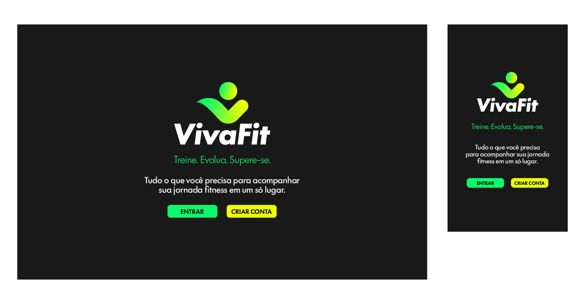
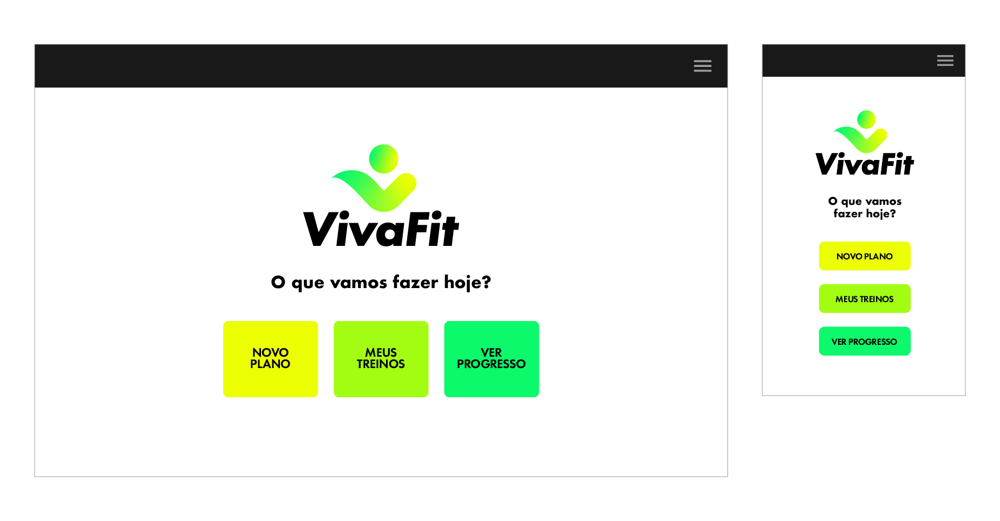

# Template Padrão da Aplicação

A seguir, apresenta-se o layout padrão da aplicação VivaFit que será utilizado em todas as páginas, com a definição de identidade visual, aspectos de responsividade e iconografia.

Foram desenvolvidos dois layouts principais, com variação de cores para melhor adaptação ao contexto de uso: um com fundo escuro, que prioriza conforto visual e destaque dos elementos, e outro com fundo claro, acompanhado de uma barra superior para organização das informações e navegação.

Além disso, cada layout possui versões para desktop e mobile, garantindo uma experiência consistente e adaptada a diferentes dispositivos. Essas variações asseguram uniformidade visual ao mesmo tempo em que oferecem flexibilidade na experiência do usuário.

## Layout Padrão 1 (Fundo Escuro)

 

## Layout Padrão 2 (Fundo Claro)

